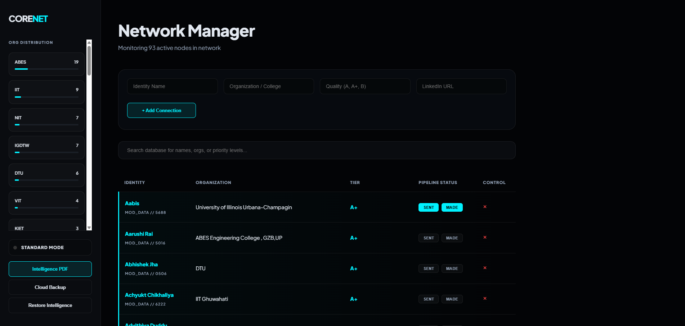
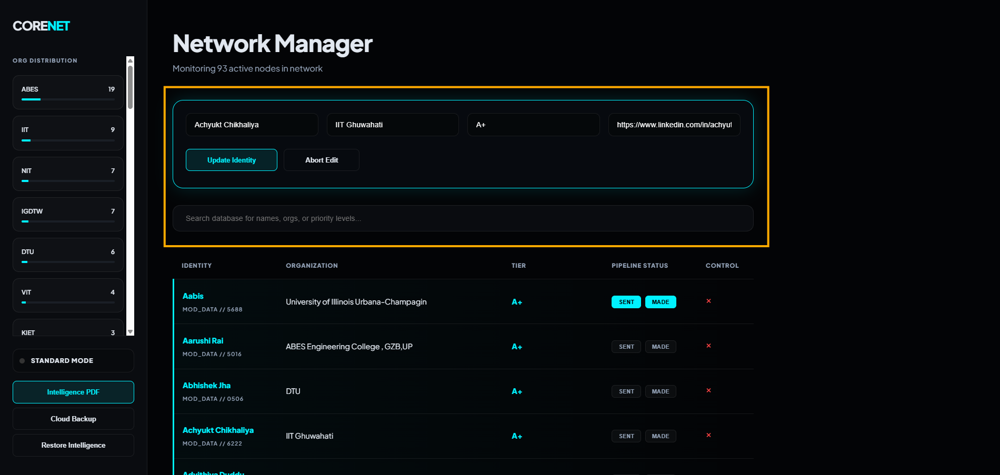
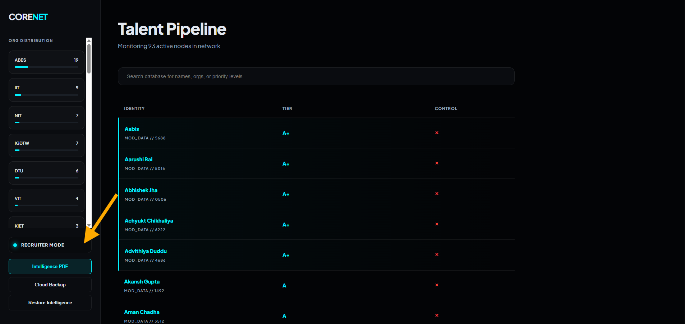

<h1 align="center">CoreNet – Intelligence Dashboard</h1>

<p align="center">
  A fast, privacy-first system to manage and track your professional network.
</p>

<p align="center">
  
  
  
  
</p>

---

## ✨ Features

- Add, edit, and delete connections  
- Instant search and filtering  
- Recruiter mode for a clean, focused view  
- LinkedIn quick access  
- Export JSON backup  
- Import data anytime  
- Generate PDF reports  
- Fully offline (no server required)  

---
## 🚀 How to Use
1. Open the HTML file in any browser  
2. Add connection details using the form  
3. Click a name to edit an entry  
4. Use the search bar to filter data  
5. Use sidebar tools for backup, restore, or PDF export  

---

## 💾 Data Storage
All data is stored locally using **browser localStorage**. No database or external server is used.

---

## 🛠️ Tech Stack
- HTML5
- CSS3
- JavaScript (Vanilla)
- jsPDF (PDF generation)

---

## 📄 License
This project is open-source and free to use.

## 📸 Screenshots

### 🖥️ Dashboard Overview
<p align="center">
  
</p>

### 🧾 Add / Edit Interface
<p align="center">
  
</p>

### 🧠 Recruiter Mode
<p align="center">
  
</p>

---

## 🚀 Quick Start

```bash
Open index.html in your browser